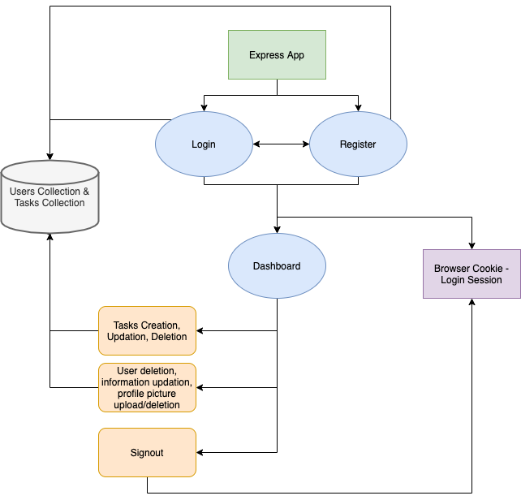

# Task Manager Application

Backend for a Task Manager Application using Express and Dynamic HTML Rendering.

### **Functionality**:

1. Registering and Login of Users
2. Creation of Tasks by Logged In users
3. Uploading,Deleting Profile Pictures
4. Edition/ Deleting Tasks or Users
5. Marking Tasks Completed and Displaying Tasks based on Completion
6. Sending Emails to newly registered users

### **Dependancies**:

1. Express
2. bcrypt
3. jswonwebtoken
4. cookie-parser
5. mongoose
6. multer
7. sharp
8. validator
9. sendgrid

### **Flowchart**:

